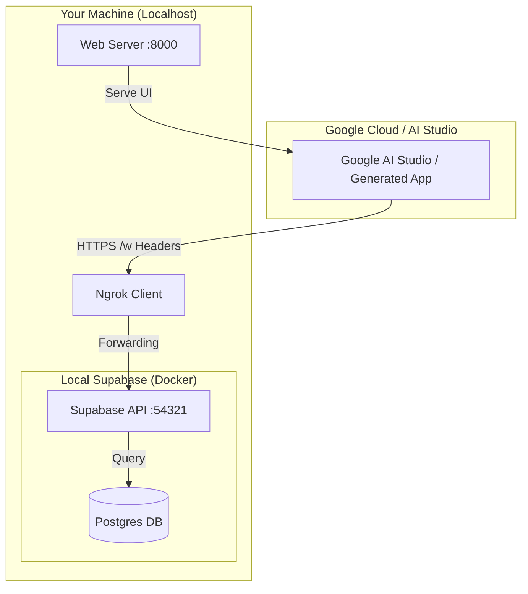

# Local Supabase + Google AI Studio Demo

This project allows you to build a full-stack App (React/JS/etc) using **Google AI Studio** that connects securely to your **Local Supabase** database.

## 🚀 Quick Start

### 1. Prerequisites
*   **Docker Desktop** (Must be running)
*   **Node.js** (for Supabase CLI)
*   **Python** (for web server)

### 2. Start Everything
Run the helper script. It initializes Supabase, starts the web server, opens an ngrok tunnel, and auto-configures your keys.

```powershell
.\start_dev.ps1
```

*   **Web UI**: [http://localhost:8000](http://localhost:8000)
*   **Supabase Studio**: [http://127.0.0.1:54323](http://127.0.0.1:54323)
*   **Public Ngrok URL**: Check the terminal output (e.g., `https://xyz.ngrok-free.dev`)

---

## 🤖 How to use with Google AI Studio

### 1. Generating Migrations (Schema Changes)
If you need to change the database schema (e.g., adding columns), use this **exact prompt** to ensure AI Studio generates valid Supabase migrations:

> You are acting as a Supabase migration generator for this project.
> 
> RULES YOU MUST FOLLOW:
> 
> 1) You must NEVER modify existing migration files.
>    - Always create a NEW migration file.
> 
> 2) You must output:
>    - The EXACT filename to create
>    - The FULL SQL content of that file
>    - Nothing else outside the format below
> 
> 3) Filename rules:
>    - Path must be: supabase/migrations/
>    - Name must start with timestamp: YYYYMMDDHHMMSS
>    - Use descriptive name in snake_case
>    Example:
>    supabase/migrations/20250203121500_add_priority_to_todos.sql
> 
> 4) SQL rules:
>    - Must be valid Supabase Postgres SQL
>    - Must be idempotent and safe
>    - Must include:
>      - Table changes
>      - Indexes if needed
>      - RLS policy updates if required
>    - Do NOT drop data unless explicitly asked
> 
> 5) Style rules:
>    - Add comments at top explaining intent
>    - Use IF NOT EXISTS where possible
>    - Follow existing schema conventions
> 
> ---
> 
> TASK:
> 
> Create a migration that implements this change:
> 
> [DESCRIBE YOUR CHANGE HERE, e.g. Add a new column priority integer default 0 to the todos table]
> 
> ---
> 
> REQUIRED OUTPUT FORMAT (follow exactly):
> 
> FILENAME:
> <path and filename>
> 
> SQL:
> ```sql
> <full sql content>
> ```

### 2. Developing the App
To let AI Studio write code for your local database, it needs to know your API structure and your public Ngrok URL.

1.  **Start the stack** (Step 2 above).
2.  **Generate the Spec**:
    Run this script. It injects your active ngrok URL into the OpenAPI specification.
    ```powershell
    python scripts/patch_supabase_openapi_servers.py
    ```
3.  **Upload to AI Studio**:
    *   Upload file: `supabase_openapi_real.txt`
    *   **IMPORTANT**: Use this prompt:
        > "The uploaded file is an OpenAPI specification (JSON content saved as .txt).

            Read and parse it as a real OpenAPI spec.

            It defines a REAL Supabase REST API (PostgREST) exposed through ngrok, including:
            - GET /rest/v1/todos
            - POST /rest/v1/todos
            - PATCH /rest/v1/todos?id=eq.<id>
            - DELETE /rest/v1/todos?id=eq.<id>

            This API connects to a real local Supabase (Docker) Postgres database.

            Build a modern, responsive web UI that uses ONLY this API.

            UI requirements:
            - List todos
            - Add new todo
            - Toggle done state
            - Priority Support (High, Medium, Low)
            - Delete todo
            - Loading states
            - Error handling
            - Empty state
            - Clean modern responsive design

            IMPORTANT API RULES:
            - ALL requests MUST use the API defined in the uploaded OpenAPI file
            - ALL requests MUST include these headers:
            - apikey: <from config>
            - Authorization: Bearer <from config>
            - Accept: application/json
            - Content-Type: application/json (for POST/PATCH)
            - ngrok-skip-browser-warning: true

            Do NOT mock data.
            Do NOT use local storage.
            Do NOT hardcode data.
            Do NOT bypass the API.
            All data must come from the real Supabase API through ngrok."

---

## 📂 Architecture



### Flow Explanation
1.  **AI Studio** (or the app it generates) makes HTTP requests to your **Public Ngrok URL**.
2.  **Ngrok** securely tunnels that request to your **Local Supabase API** (port 54321).
3.  **Supabase** reads/writes to the **Postgres Database** and returns JSON.
4.  Your **Web Server** (port 8000) just serves the static HTML/JS files that AI Studio created/modified.

---

## 📄 File Descriptions

### Root
*   `start_dev.ps1`: **The Magic Script**. Runs Supabase, Web Server, Ngrok, and Auto-Config all at once.
*   `README.md`: This documentation.

### Web (Frontend)
*   `web/index.html`: Main HTML entry point.
*   `web/app.js`: Main vanilla JS logic for the UI.
*   `web/config.js`: **Configuration File**. Holds your Supabase URL and API Key (updated automatically by `start_dev.ps1`).
*   `web/services/todoService.js`: API Client class. Handles all communication with Supabase (GET, POST, PATCH, DELETE).

### Supabase (Backend/DB)
*   `supabase/migrations/20240130000000_create_todos.sql`: SQL file that defines the `todos` table and security policies. Automatically applied when Supabase starts.

### Scripts (Tooling)
*   `scripts/auto_config.js`: value-add script that grabs your local API Key from Supabase and pastes it into `web/config.js`.
*   `scripts/patch_supabase_openapi_servers.py`: Reads your current Ngrok URL and updates the OpenAPI spec so AI Studio knows where to send requests.

---

## 🛠️ Troubleshooting

**"Failed to parse JSON"**
*   Google AI Studio is hitting the Ngrok "Browser Warning" page.
*   **Fix**: Ensure your prompt includes: *"Add header `ngrok-skip-browser-warning: true`"*.

**"Connection Refused"**
*   Is Docker running?
*   Did you run `.\start_dev.ps1`?

**"401 Unauthorized"**
*   Check `web/config.js`.
*   If keys are missing, run `node scripts/auto_config.js` while Supabase is running.


## ✅ Smoke Test

### 1. Test Supabase API (via ngrok)
Run this in PowerShell to verify the API is reachable:
```powershell
$Url = "https://your-ngrok-url.ngrok-free.dev/rest/v1/todos"
$Key = "your-anon-key-from-config-js"

Invoke-RestMethod -Method Get -Uri $Url `
  -Headers @{
    "apikey" = $Key
    "Authorization" = "Bearer $Key"
    "ngrok-skip-browser-warning" = "true"
  } | ConvertTo-Json -Depth 10
```
**Expected Output:** JSON array of todos `[...]`.

### 2. Test UI
1.  Open: [http://localhost:8000](http://localhost:8000)
2.  Add a todo item.
3.  **Verify**: Check [Supabase Studio](http://127.0.0.1:54323) -> Table Editor -> `todos` to see if it appeared.
